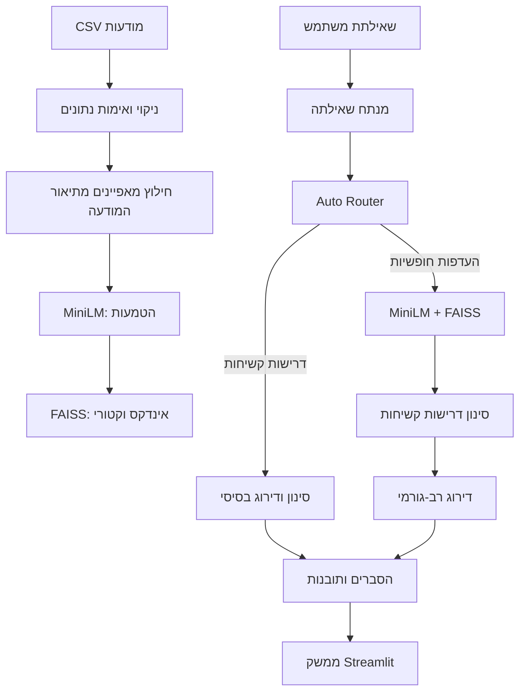

# חיפוש רכב חכם

מערכת חיפוש לרכבים יד שנייה בעברית. היא משלבת הבנת שאילתות, חיפוש סמנטי ודירוג מבוסס מאפייני רכב, כדי להפוך בקשה טבעית כמו "משפחתית חסכונית באזור חיפה" לתוצאות רלוונטיות ומוסברות.

האפליקציה כוללת מאגר דוגמה של מודעות רכב ופועלת מקומית, ללא מפתח API וללא שירות ענן.

## מה אפשר לעשות

- לחפש בעברית חופשית, למשל לפי יצרן, דגם, תקציב, שנתון, קילומטראז', גיר, דלק ומיקום.
- לקבל מסלול חיפוש מותאם אוטומטית: סינון מדויק לדרישות קשיחות או חיפוש סמנטי להעדפות חופשיות.
- לראות הסבר לכל התאמה ותובנות על סוג הרכב.
- להפעיל דוח הערכה פנימי של איכות החיפוש.
- להשתמש במחשבון שווי מבוסס מודעות דומות.

## הפעלה מהירה

### דרישות

- Python 3.10 ומעלה
- `pip`

### התקנה והרצה

```bash
git clone https://github.com/evronbar/marketplace-car-finder.git
cd marketplace-car-finder

python -m venv .venv
source .venv/bin/activate
python -m pip install --upgrade pip
pip install -r requirements.txt

streamlit run app.py
```

לאחר ההרצה פתחו את הכתובת שמודפסת במסוף, בדרך כלל `http://localhost:8501`.

ב-Windows, הפעלת הסביבה הווירטואלית היא:

```powershell
.venv\Scripts\Activate.ps1
```

בהרצה הראשונה יורד מודל ההטמעות `paraphrase-multilingual-MiniLM-L12-v2`, ולאחר מכן הוא נשמר במטמון. אם המודל אינו זמין, המערכת משתמשת בייצוג גיבוי דטרמיניסטי כדי להישאר זמינה, אך איכות החיפוש הסמנטי תהיה נמוכה יותר.

## נסו לחפש

```text
מאזדה 3 אוטומטית עד 70 אלף
רכב משפחתי חסכוני באזור חיפה
ג'יפון אמין לנסיעות ארוכות עד 100000
רכב ראשון לנהג צעיר
```

## ארכיטקטורה



### רכיבי הליבה

| רכיב | תפקיד |
| --- | --- |
| `src/nlu/query_parser.py` | מחלץ מהטקסט אילוצים קשיחים והעדפות רכות באמצעות כללים ומילונים. |
| `src/search/embedder.py` | טוען את `paraphrase-multilingual-MiniLM-L12-v2` ומייצר הטמעות למודעות ולשאילתות. |
| `src/search/index_builder.py` | בונה אינדקס `FAISS IndexFlatIP` לחיפוש וקטורי לפי דמיון קוסינוס. |
| `src/search/router.py` | בוחר אוטומטית בין מסלול בסיסי למסלול סמנטי, עם מעבר למסלול החלופי כאשר אין תוצאות. |
| `src/ranking/ranker.py` | משקלל דמיון סמנטי, איכות רכב, התאמת מאפיינים, אילוצים ומיקום. |
| `src/valuation/calculator.py` | מעריך שווי לפי מודעות דומות, עם תיקונים לשנתון, קילומטראז', בעלים, גיר, דלק, מיקום ומצב. |

אין בפרויקט קריאה למודל LLM חיצוני. רכיב ההערכה בשם `llm_judge.py` בונה תבנית הערכה, אך בפועל מפעיל שיפוט כללי דטרמיניסטי.

## מחשבון שווי

מחשבון השווי בוחר קודם מודעות של אותו דגם, אחר כך אותו יצרן, אחר כך אותה קטגוריית רכב ולבסוף מאגר כללי. הוא מדרג את ההשוואות, מתקן את מחיריהן לפי נתוני רכב המטרה, ומחזיר:

- מחיר מוערך: החציון של המחירים המתוקנים.
- טווח נמוך וגבוה: רבעון תחתון ועליון כאשר יש מספיק השוואות.
- רמת ביטחון, מספר מודעות להשוואה והנמקה קצרה.

הרכיב זמין כמודול Python, אך אינו מוצג עדיין במסך החיפוש הראשי.

## הרצה משורת הפקודה

להדגמה מהירה של כל צינור החיפוש:

```bash
python main.py "מאזדה 3 אוטומטית עד 70 אלף"
```

## בדיקות

```bash
pytest -q
```

הבדיקות מכסות טעינת נתונים, אימות, קיבוץ מיקומים, מדדי הערכה, תובנות רכב ומחשבון השווי.

## מבנה הפרויקט

```text
app.py                  ממשק Streamlit
main.py                 הדגמת חיפוש במסוף
config.py               נתיבים והגדרות מרכזיות
data/raw/               מאגר הדוגמה
src/data/               טעינה, ניקוי, אימות וחילוץ מאפיינים
src/nlu/                פירוק שאילתות בעברית
src/search/             הטמעות, אינדוקס, חיפוש וניתוב
src/ranking/            דירוג תוצאות
src/explanation/        הסברים לתוצאות
src/knowledge/          תובנות לפי סוג רכב
src/valuation/          מחשבון שווי
src/evaluation/         מדידה והשוואת אסטרטגיות
tests/                  בדיקות אוטומטיות
```

## נתונים והסתייגויות

הפרויקט מיועד להדגמה וללמידה. הערכת השווי והתוצאות תלויות באיכות ובהיקף מודעות הדוגמה, ואינן תחליף לבדיקה מקצועית או למחירון רשמי.
