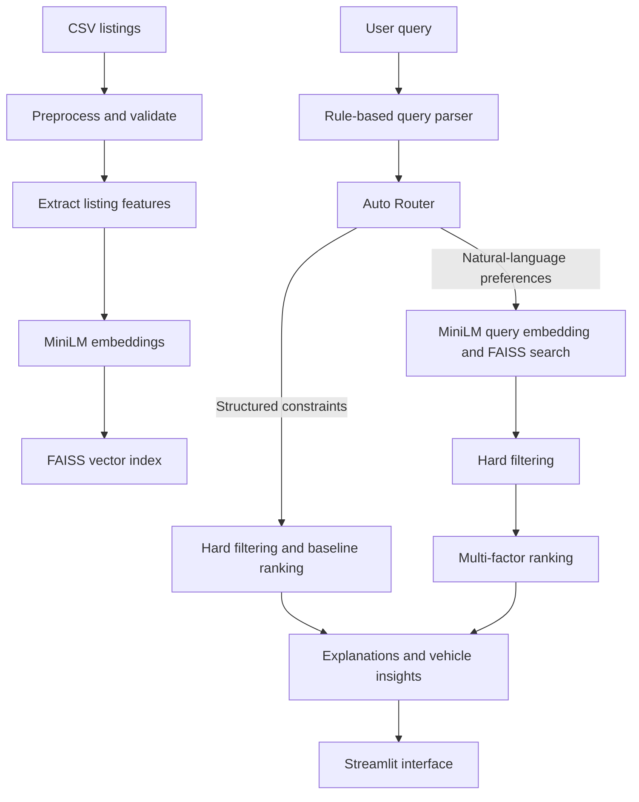

# Smart Car Finder

> A Hebrew-first used-car search application that combines structured filtering, semantic retrieval, and transparent ranking.

[](https://www.python.org/)
[](https://streamlit.io/)
[](#testing)

Smart Car Finder turns a natural-language car request into relevant, explainable used-car results. The included sample dataset lets the project run locally without API keys or cloud services.

## Highlights

- **Natural-language search** for make, model, budget, year, mileage, transmission, fuel type, and location.
- **Auto Router** that selects either precise constraint-based search or semantic search for every request.
- **Semantic retrieval** with `paraphrase-multilingual-MiniLM-L12-v2` and FAISS.
- **Explainable ranking** based on relevance, vehicle quality, requested features, hard constraints, and location.
- **Built-in evaluation** for NLU, retrieval, ranking variants, performance, and rule-based judging.
- **Comparable-based valuation** with adjustments for year, mileage, ownership history, transmission, fuel, location, and condition.

## Quick Start

### Prerequisites

- Python 3.10 or newer
- `pip`

### Install and run

```bash
git clone https://github.com/roeeseri/marketplace-car-finder.git
cd marketplace-car-finder

python -m venv .venv
source .venv/bin/activate
python -m pip install --upgrade pip
pip install -r requirements.txt

streamlit run app.py
```

Open the local address printed by Streamlit, usually `http://localhost:8501`.

On Windows, activate the virtual environment with:

```powershell
.venv\Scripts\Activate.ps1
```

The first run downloads the embedding model and caches it locally. If the model cannot be loaded, the application keeps working with a deterministic fallback vectorizer, although semantic-search quality will be reduced.

## Product Scope

The user interface and query parser are designed for Hebrew car-search requests. The repository documentation is intentionally written in English for an international developer audience.

## Architecture



### Search pipeline

1. Listings are loaded, normalized, validated, and enriched with keyword-based features.
2. The embedding model converts listing text into vectors; FAISS stores them for similarity search.
3. The query parser extracts hard constraints and soft preferences.
4. Auto Router chooses a route:
   - **Baseline** for short, highly structured requests with clear constraints.
   - **Smart** for longer requests that contain intent or lifestyle preferences.
5. Results are filtered against hard requirements, ranked, and returned with human-readable explanations.
6. If the chosen route has no results, the router tries the alternative route automatically.

## Core Components

| Component | Responsibility |
| --- | --- |
| `src/nlu/query_parser.py` | Extracts hard constraints and soft preferences using rules and dictionaries. |
| `src/search/embedder.py` | Loads `paraphrase-multilingual-MiniLM-L12-v2` and creates listing and query embeddings. |
| `src/search/index_builder.py` | Builds a `FAISS IndexFlatIP` vector index for cosine-similarity retrieval. |
| `src/search/router.py` | Chooses the search route and provides a fallback when a route returns no results. |
| `src/ranking/ranker.py` | Combines semantic relevance, vehicle quality, feature fit, hard constraints, and location fit. |
| `src/explanation/explainer.py` | Produces result-level explanations. |
| `src/valuation/calculator.py` | Estimates value from comparable listings and explicit adjustment factors. |

## Models and AI

The primary model is [`paraphrase-multilingual-MiniLM-L12-v2`](https://www.sbert.net/docs/sentence_transformer/pretrained_models.html), loaded through Sentence Transformers. It generates 384-dimensional multilingual embeddings for listings and search queries.

FAISS is the retrieval engine, not a model. It performs inner-product search over normalized vectors, which corresponds to cosine similarity.

The application does **not** call an external LLM. `src/evaluation/llm_judge.py` contains a judge-prompt template, but its actual scoring is deterministic and rule-based.

## Valuation Engine

The valuation module selects comparable listings in this order:

1. Same make and model.
2. Same make.
3. Same inferred vehicle class.
4. General comparable pool.

It scores candidates, selects the strongest comparisons, then adjusts their prices for model year, mileage, ownership count, transmission, fuel type, location, and stated condition. The final estimate is the median adjusted price; the low and high values are derived from the adjusted-price distribution.

The valuation engine is available as a Python module. It is not yet exposed in the main Streamlit screen.

## Command-Line Demo

Run the complete search pipeline from the command line:

```bash
python main.py
```

Pass a query as an argument to override the built-in example:

```bash
python main.py "Mazda 3 automatic under 70000"
```

## Testing

```bash
pytest -q
```

The test suite covers data loading and validation, location grouping, evaluation metrics, vehicle insights, and the valuation engine.

## Project Structure

```text
app.py                  Streamlit application
main.py                 Command-line search demo
config.py               Central paths and configuration
data/raw/               Included sample listings
src/data/               Loading, preprocessing, validation, and feature extraction
src/nlu/                Hebrew query parsing
src/search/             Embeddings, indexing, retrieval, filtering, and routing
src/ranking/            Result ranking
src/explanation/        Search-result explanations
src/knowledge/          Vehicle-class insights
src/valuation/          Comparable-based valuation
src/evaluation/         Metrics and evaluation reports
tests/                  Automated tests
```

## Notes

This project is intended for learning and demonstration. Search quality and valuation outputs depend on the scope and quality of the included sample listings; they are not a substitute for a professional inspection or an official pricing guide.
